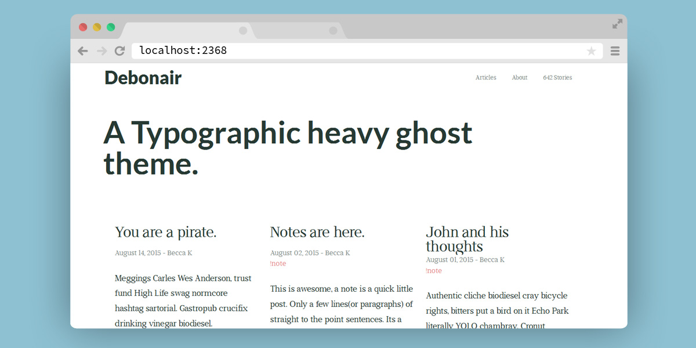
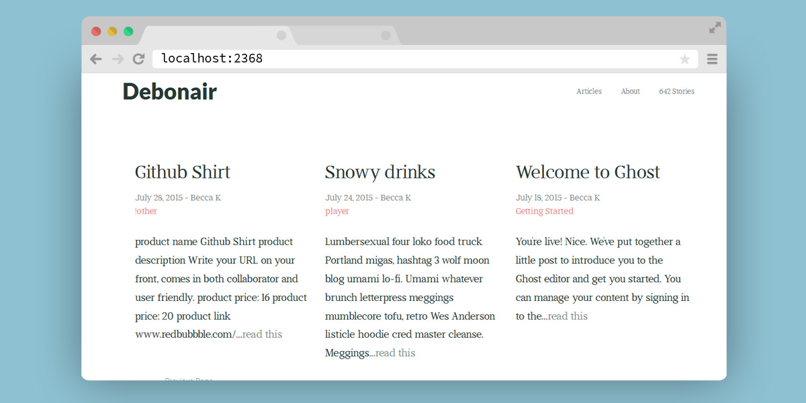
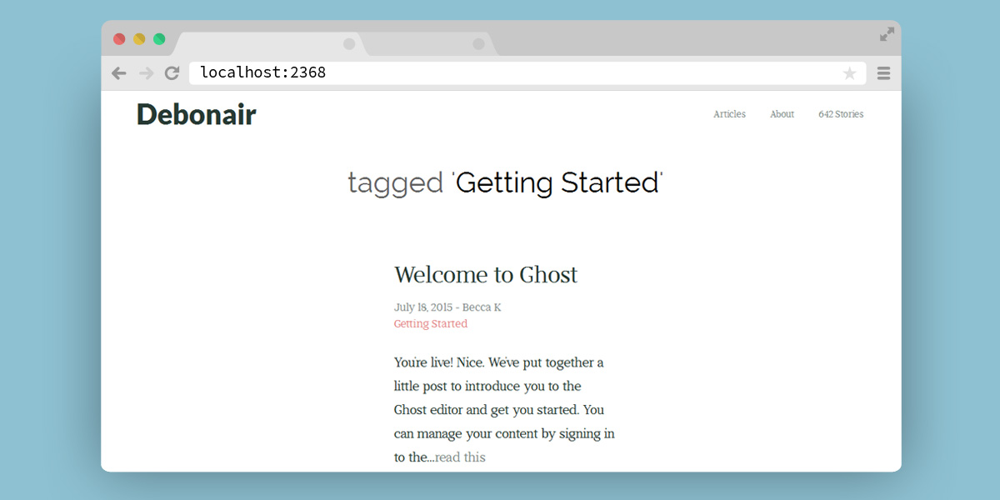
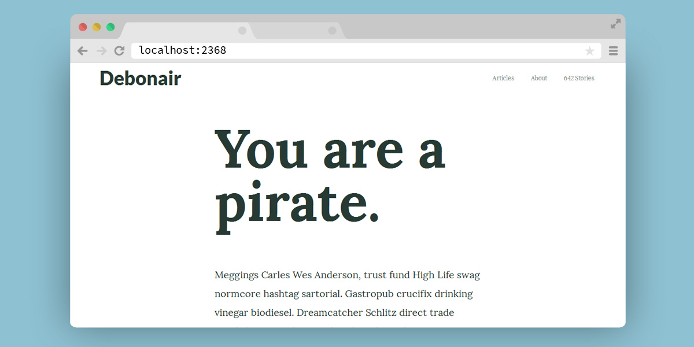

# Debonair

A free, Typographic Ghost theme.

_Im still working on this in my spare time_

if you see a bug or have a great idea on how to improve Debonair, Dont hesitate to [create a new issue](https://github.com/DanielTamkin/debonair/issues) or Tweet me [@CodeHands](https://twitter.com/CodeHands)

### Installation
 1. Install Debonair to your Themes directory located at `ghost\content\themes`
 2. login to your ghost admin panel.
 3. navigate to your `settings/general` panel.
 4. Change your Theme setting to `Debonair`

 ### Home
 

 ### Loop
 

 ## Tag
 

 ### Post
 

 Details
 ---
 | Fonts  | Whats it's use? |
 | ------------- |------------- |
 | [Didactic](https://www.google.com/fonts#UsePlace:use/Collection:Didactic)  | Standard `body` font |
 | [Socicon](https://www.google.com/fonts#UsePlace:use/Collection:Lato)  | Social icons |
 | [Lato](https://www.google.com/fonts#UsePlace:use/Collection:Lato)  | For important things like the nav, author description & footer |
 | [Cardo](https://www.google.com/fonts#UsePlace:use/Collection:Lato)  | The big headers for the posts |
